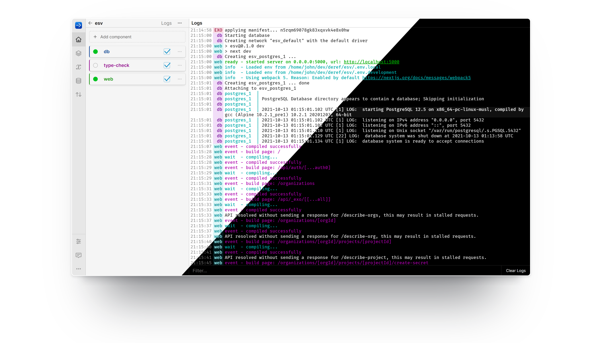

# About Exo

Exo is a process manager and log viewer for your development environment.

## Features

* Procfile and Docker Compose compatible process manager.
* Terminal commands and browser-based-GUI for all functionality.
* Multiplexed, colorizing log tailing. Toggle visibility of individual logs.
* Dynamic process supervision: create, start, stop, restart, delete.

## Getting Started

Ready to dive in?

Check out the [quick start guide](getting-started/quick-start.md).
